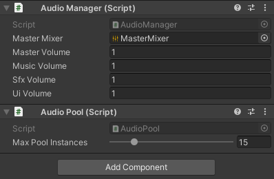
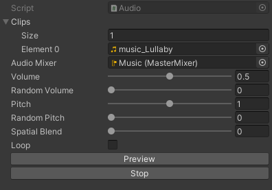
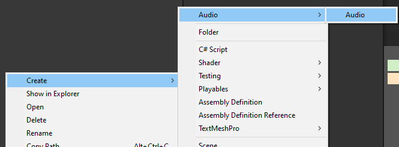
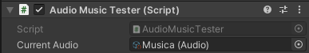

# ID Audio

This a custom AudioManager and AudioPooling tool to handle all interactions with audio in Unity3D. It's a scriptable object based Audio.




**Features:**
* Full control over audios (Play, Pause, Stop, ...)
* Audio Types
* Audio Pooling
* Volume control
* Automatic max Audiopooling control
* Multiple clips
* Modify parameters of audio on your own
* ExtendableAudioSource component
* CustomEditors
* Integrated with Unity Editor





**Planned Features:**
* Custom AudioGroup Types
* AudioGroupType control
* Extendable audios
* Tooltips


**HOW TO USE**
1. Create a GameObject and Attach AudioManager.
2. Create an Audio and fill the parameters.



3. Attach it to the object you want to Play and call the appropiate method.




**API**

```
AudioManager.Play(Audio audio);

AudioManager.PlayOnce(Audio audio);

AudioManager.PlayDelayed(Audio audio, float delay);

AudioManager.Pause(Audio audio);

AudioManager.Resume(Audio audio);

AudioManager.Stop(Audio audio);
```


It's inspired by:

[Unite 2016 - Overthrowing the MonoBehaviour Tyranny in a Glorious Scriptable Object Revolution](https://www.youtube.com/watch?v=6vmRwLYWNRo)

[How to Make an Advanced AudioManager in Unity](https://www.technoob.me/2019/01/how-to-make-advanced-audio-manager-unity.html)
